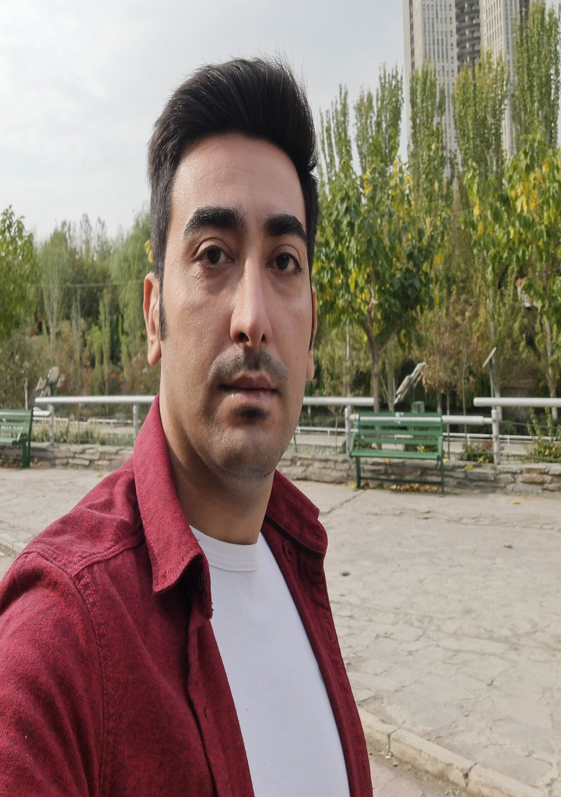

    
    <h1>سلام! من محسن آقاجانی هستم</h1>
    
من مهندس فناوری اطلاعات و توسعه‌دهنده نرم‌افزار هستم. در حال حاضر، به عنوان بک‌اند دولوپر در شرکت <strong>وایزترک</strong> فعالیت می‌کنم. به برنامه‌نویسی، حل چالش‌های فنی و یادگیری تکنولوژی‌های جدید علاقه زیادی دارم.

## مهارت‌ها
- **PHP** و **Laravel**
- **MySQL** و **Git**
- **زبان انگلیسی** (متوسط)
- **مهارت‌های شبکه** (مقدماتی)

## تجربه کاری
### بک‌اند دولوپر | وایزترک
**۱۴۰۰ – حالا**  
مسئولیت توسعه سیستم‌های پیچیده با استفاده از PHP و Laravel در این شرکت را دارم.

## سوابق تحصیلی
- **فناوری اطلاعات** | دانشگاه علمی کاربردی صنایع و معادن (۱۳۹۳ – ۱۳۹۷)

## تماس با من
- ایمیل: [aghajani69m@gmail.com](mailto:aghajani69m@gmail.com)
- شماره موبایل: ۰۹۱۲۴۵۱۹۱۸۹
- تلگرام: [@username](https://t.me/Aghajani69M)
- لینکدین: [محسن آقاجانی](https://www.linkedin.com/in/aghajani69m)
